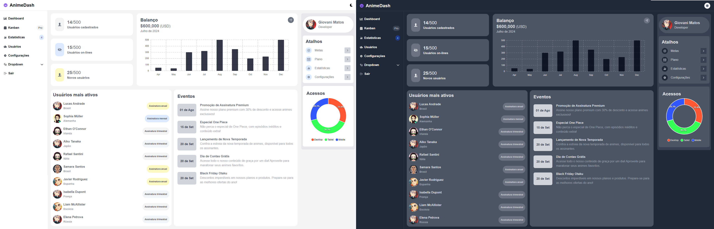

# AnimeDash

🌟 **Anime Dashboard: Uma Mostra de Habilidades** 🌟

Explore o meu mais recente projeto: um sofisticado **dashboard** dedicado ao mundo dos animes, desenvolvido com **React**, **Tailwind CSS** e **TypeScript**. Este projeto foi criado para testar e aprimorar minhas habilidades em tecnologias modernas e criar uma interface envolvente e responsiva.

## Funcionalidades

- **Design Responsivo**: Adaptado para diferentes tamanhos de tela, garantindo uma experiência fluida em dispositivos móveis e desktop.
- **Interface Interativa**: Navegação intuitiva e interativa, com foco na experiência do usuário.
- **Estética Moderna**: Utiliza Tailwind CSS para um design limpo e moderno.

## Tecnologias Utilizadas

- **React**: Biblioteca para construção de interfaces de usuário.
- **Tailwind CSS**: Framework de CSS utilitário para design rápido e responsivo.
- **TypeScript**: Superset do JavaScript que adiciona tipagem estática ao código.

## Imagem


## Como Executar o Projeto

1. **Clone o Repositório**

   ```bash
   git clone https://github.com/giovanimf/AnimeDash.git
